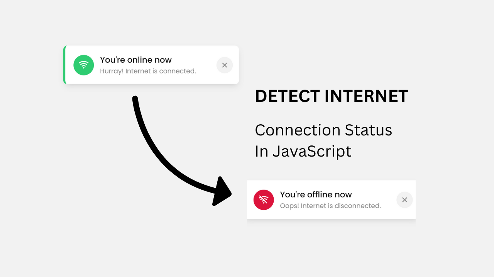

# Detect Network Status (Online/Offline)

This is a simple project that detects the network status of the user using `navigator.onLine` method and displays a toast message accordingly.

# [Watch on Youtube]()

## Features

- Detects the network status of the user.
- Displays a toast message accordingly.
- Animates the toast message.

💙 Join the Channel to see more videos like this. [CodeWithMangesh](https://www.youtube.com/@CodeWithMangesh)

